<div style="text-align: right">
</div>

# Hi there, I'm Vedant 

<a href="https://app.daily.dev/Envoy_"></a>

<p align="center">

</p>


## Connect with me 

<br>
<a href="https://twitter.com/Envoy_1084"></a>
<a href="https://www.linkedin.com/in/vedant-chainani/"></a>
<a href="https://www.reddit.com/user/envoyVC1084"></a>
<a href="mailto:vedantchainani1084@gmail.com"></a>
<a href="https://dev.to/envoy_"></a>
<a href="https://steamcommunity.com/profiles/76561199077181432/"></a>
<a href="https://open.spotify.com/user/31ojwb23shspr6yxfudndihfrvae"></a>


## I'm a Student!!

- 🌱 I’m currently learning Blockchain
- 👯 I’m looking to contribute to open source
- 🥅 2022 Goals: Learn more about Blockchains and Solidity
- ⚡ Fun fact: I love to play games
  <br>


<br>


###  A little more about me...

```javascript
const vedant = {
    pronouns: "He" | "Him",
    code: ["Javascript", "Python","HTML", "CSS","MySQL"],
    askMeAbout: ["WebDev", "Tech", "Gaming"],
    technologies: {
        backEnd: {
            js: ["Node"],
        },
        devOps: ["AWS", "Docker🐳"],
        databases: ["mongo", "MySql", "sqlite"],
        misc: ["Firebase", "Socket.IO", "selenium", "open-cv", "php", "SuiteApp","discord.py"]
    },
    currentFocus: "Python",
    fun: "Two bytes meet.  The first byte asks, 'Are you ill?'
          The second byte replies, 'No, just feeling a bit off.'"
};
```

<br>
</img>

<br>

# 🤹 My Skill Set

<table><tr><td valign="top" width="33%">

## Frontend

<div align="center">  
  
  
  
  
  
  
  
  
  
  
  
  
  
</div>

</td><td valign="top" width="33%">

## Backend

<div align="center">  
  
  
  
  
  
  
  
  
  
  
</div>

</td><td valign="top" width="33%">

## DevOps

<div align="center">  
  
  
  
  
</div>

</td></tr></table>

<br>
<br>

</img>

<br>

## 📊 Github Stats

<table><tr><td valign="top" width="50%">

<br>


</td><td valign="top" width="50%">



</td></tr></table>

<table><tr><td valign="top" width="50%">


</td><td valign="top" width="50%">


</td></tr></table>

<br>

</img>

<br>

## 📊 Development Breakdown

<br>


<br>

</img>

## 📕 Blog Posts

<br>


<br>

</img>

## ✨ My Followers

<!--START_SECTION:top-followers-->
<table>
  <tr>
    <td align="center">
      <a href="https://github.com/Dev-HideyukiTakahashi">
        
      </a>
      <br />
      <a href="https://github.com/Dev-HideyukiTakahashi">Hideyuki Takahashi</a>
    </td>
    <td align="center">
      <a href="https://github.com/Bornunique911">
        
      </a>
      <br />
      <a href="https://github.com/Bornunique911">Bornunique911</a>
    </td>
    <td align="center">
      <a href="https://github.com/Amarjit-ph">
        
      </a>
      <br />
      <a href="https://github.com/Amarjit-ph">Amarjit Pheiroijam</a>
    </td>
    <td align="center">
      <a href="https://github.com/OxygenXXX">
        
      </a>
      <br />
      <a href="https://github.com/OxygenXXX">Haruka Nakano</a>
    </td>
    <td align="center">
      <a href="https://github.com/bglamadrid">
        
      </a>
      <br />
      <a href="https://github.com/bglamadrid">Benjamin La Madrid</a>
    </td>
    <td align="center">
      <a href="https://github.com/Zorono">
        
      </a>
      <br />
      <a href="https://github.com/Zorono">[BR]John_Magdy</a>
    </td>
    <td align="center">
      <a href="https://github.com/marioarl">
        
      </a>
      <br />
      <a href="https://github.com/marioarl">Mario Augusto Lima</a>
    </td>
  </tr>
  <tr>
    <td align="center">
      <a href="https://github.com/blacky-yg">
        
      </a>
      <br />
      <a href="https://github.com/blacky-yg">Hamidou TESSILIMI</a>
    </td>
    <td align="center">
      <a href="https://github.com/pierrete">
        
      </a>
      <br />
      <a href="https://github.com/pierrete">Pamela Rod</a>
    </td>
    <td align="center">
      <a href="https://github.com/vicbarkfeld">
        
      </a>
      <br />
      <a href="https://github.com/vicbarkfeld">Victoria Barkfeld</a>
    </td>
    <td align="center">
      <a href="https://github.com/nikoescobal">
        
      </a>
      <br />
      <a href="https://github.com/nikoescobal">Nikolas Escobal</a>
    </td>
    <td align="center">
      <a href="https://github.com/liesauer">
        
      </a>
      <br />
      <a href="https://github.com/liesauer">L!εsAμεr</a>
    </td>
    <td align="center">
      <a href="https://github.com/ericasrafael">
        
      </a>
      <br />
      <a href="https://github.com/ericasrafael">Erica Rafael</a>
    </td>
    <td align="center">
      <a href="https://github.com/Camargovf">
        
      </a>
      <br />
      <a href="https://github.com/Camargovf">Valdeir Camargo</a>
    </td>
  </tr>
</table>
<!--END_SECTION:top-followers-->

</img>

<br>

## 🌸 Latest Tweets

<br>

<a href="https://www.twitter.com/Envoy_1084"></a>

<br>

</img>

<br>

##  Now Playing

<br>

<!-- lastfm -->
<p align="center"><a href="https://www.last.fm/music/Astrid+S/Leave+It+Beautiful"></a> <a href="https://www.last.fm/music/Brynn+Elliott/Beautiful+Things"></a> <a href="https://www.last.fm/music/Nessa+Barrett/pretty+poison"></a> <a href="https://www.last.fm/music/Tyler+Shaw/Intuition"></a> <a href="https://www.last.fm/music/Ariana+Grande/thank+u,+next"></a> <a href="https://www.last.fm/music/Ashe/Moral+of+the+Story"></a> <a href="https://www.last.fm/music/Astrid+S/Doing+To+Me+(Stripped+Down)"></a> <a href="https://www.last.fm/music/Astrid+S/It%27s+OK+If+You+Forget+Me"></a> <a href="https://www.last.fm/music/Astrid+S/Think+Before+I+Talk"></a> <a href="https://www.last.fm/music/Astrid+S/Trust+Issues"></a> <a href="https://www.last.fm/music/Ava+Max/Heaven+&+Hell"></a> <a href="https://www.last.fm/music/Boy+in+Space/Let+You+Go"></a> <a href="https://www.last.fm/music/Charlie+Puth/Cheating+on+You"></a> <a href="https://www.last.fm/music/Cher+Lloyd/None+of+My+Business"></a> <a href="https://www.last.fm/music/Coldplay/Memories...Do+Not+Open"></a> <a href="https://www.last.fm/music/Conor+Maynard/Crowded+Room"></a> <a href="https://www.last.fm/music/Dermot+Kennedy/sometHIng+To+someONE"></a> <a href="https://www.last.fm/music/Ed+Sheeran/Afterglow"></a> <a href="https://www.last.fm/music/Em+Beihold/Infrared"></a> <a href="https://www.last.fm/music/Gracie+Abrams/Mean+It"></a> <a href="https://www.last.fm/music/Gracie+Abrams/This+Is+What+It+Feels+Like"></a> <a href="https://www.last.fm/music/Griff/Inside+Out"></a> <a href="https://www.last.fm/music/Halsey/Manic"></a> <a href="https://www.last.fm/music/Jenna+Raine/see+you+later+(ten+years)"></a> </p>


<br>

</img>

<br>

## ⚙️ Misc

<br>

<table><tr><td valign="top" width="50%">


</td><td valign="top" width="50%">


</td></tr></table>

<br>
<br>


<br>

</img>